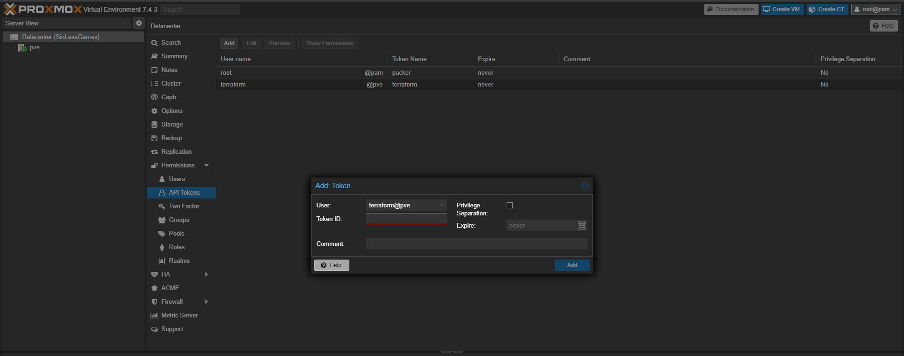

# Proxmox k3s GitOps Repository

> [!IMPORTANT]
> This repository is a template to manage your Infrastructure as Code (IaC) using GitOps with k3s and Flux.
> This cluster also makes use of [devcontainers](https://code.visualstudio.com/docs/remote/containers) to provide a consistent development environment.
> This repository assumes you have a working Proxmox server with ssh access and a registered domain name.

This repository is a template to manage your Infrastructure as Code (IaC) using GitOps with [k3s](https://k3s.io/) and [Flux](https://fluxcd.io/).
This repo uses several tools to manage the infrastructure, these are:

  1. [Ansible](https://www.ansible.com/): Ansible is used to manage the configuration of the cluster and the virtual machines on Proxmox.
  2. [Terraform](https://www.terraform.io/): Terraform is used to create the virtual machines on Proxmox and manage thier hardware configuration.
  3. [k3s](https://k3s.io/): k3s is a lightweight Kubernetes distribution that is used to manage the cluster.
  4. [Flux](https://fluxcd.io/)/[Gitops](https://docs.gitops.weave.works/)/[Flagger](https://www.weave.works/oss/flagger/)/[Scope](https://www.weave.works/oss/scope/): These tools are used to manage the cluster and the applications running on it.
  5. [Sops](https://github.com/getsops/sops)/[Age](https://github.com/FiloSottile/age): These tools are used to manage the secrets in the repository.

This repository is designed to be used with [Visual Studio Code](https://code.visualstudio.com/) and [devcontainers](https://code.visualstudio.com/docs/remote/containers) to provide a consistent development environment.

## Prerequisites

Before you begin, ensure you have met the following requirements:

* You have installed [Visual Studio Code](https://code.visualstudio.com/).
* You have installed the [Remote - Containers](https://marketplace.visualstudio.com/items?itemName=ms-vscode-remote.remote-containers) extension for Visual Studio Code.
* You have installed [Docker](https://www.docker.com/).

## Using Proxmox k3s GitOps Repository

Once you have installed Talos or Debian on your nodes, there are six stages to getting a Flux-managed cluster up and runnning.

> [!NOTE]
> For all stages below the commands **MUST** be ran on your personal workstation within your repository directory

### 🎉 Stage 1: Create a Git repository

1. Create a new **public** repository by clicking the big green "Use this template" button at the top of this page.

2. Clone **your new repo** to you local workstation and `cd` into it.

3. Continue on to 🌱 [**Stage 2**](#-stage-2-setup-your-local-workstation)

### 🌱 Stage 2: Setup your local workstation

You have two different options for setting up your local workstation.

* First option is using a `devcontainer` which requires you to have Docker and VSCode installed. This method is the fastest to get going because all the required CLI tools are provided for you in my [devcontainer](https://github.com/onedr0p/cluster-template/pkgs/container/cluster-template%2Fdevcontainer) image.
* The second option is setting up the CLI tools directly on your workstation.

1. Start Docker and open your repository in VSCode. There will be a pop-up asking you to use the `devcontainer`, click the button to start using it.

2. Continue on to 🔧 [**Stage 3**](#-stage-3-create-a-role-and-api-token-for-terraform)

### 🔧 Stage 3: Create a Role and API token for Terraform

1. Create a new role in Proxmox

    ```sh
      pveum role add terraform_role -privs "Datastore.AllocateSpace Datastore.Audit Pool.Allocate Sys.Audit Sys.Console Sys.Modify VM.Allocate VM.Audit VM.Clone VM.Config.CDROM VM.Config.Cloudinit VM.Config.CPU VM.Config.Disk VM.Config.HWType VM.Config.Memory VM.Config.Network VM.Config.Options VM.Migrate VM.Monitor VM.PowerMgmt"
    ```

2. Create a new user in Proxmox

    ```sh
      pveum user add terraform@pve --password <your_secret_password>
    ```

3. Assign the role to the user

    ```sh
      pveum aclmod / -user terraform@pve -role terraform_role
    ```

4. Go to the Proxmox web interface and login with the root user.

5. go to the datacenter and go to permissions

6. click the Api Token tab and click add

    

7. Fill out the form and click add

    You will need to copy the `token` and `username` to the `config.yaml` file in the next stage.

8. Continue on to ⚡ [**Stage 4**](#-stage-4-configure-the-repository)

### ⚡ Stage 4: Configure the repository

> [!NOTE]
> The [config.sample.yaml](./config.sample.yaml) file contains config that is **vital** to the bootstrap process.

1. Generate the `config.yaml` from the [config.sample.yaml](./config.sample.yaml) configuration file.

    ```sh
    task init
    ```

2. Fill out the `config.yaml` configuration file using the comments in that file as a guide.

3. Run the following command which will generate all the files needed to continue.

    ```sh
    task configure
    ```

4. Push you changes to git

   📍 _**Verify** all the `./kubernetes/**/*.sops.*` files are **encrypted** with SOPS_

    ```sh
    git add -A
    git commit -m "Initial commit :rocket:"
    git push
    ```

5. Continue on to ⚡ [**Stage 5**](#-stage-5-create-template-vm)

### ⚡ Stage 5: Create template VM

<!-- TODO: Create a bash script that does this step for the user -->

1. SSH into your Proxmox server

    ```sh
    ssh root@<proxmox-ip>
    ```

2. Install libguestfs-tools
    > [!WARNING]
    > If you do not have a proxmox enterprise subscription you will need to not run `apt update` as this will throw an error.

    ```sh
    apt update && apt install -y libguestfs-tools
    ```

3. Download debian cloud image

      ```sh
      wget https://cloud.debian.org/images/cloud/buster/20210927-625/debian-11-generic-amd64-20210927-625.qcow2
      ```

4. Install qemu-guest-agent in the cloud image

      ```sh
      virt-customize -a debian-11-generic-amd64-20210927-625.qcow2 --install qemu-guest-agent
      ```

5. Create VM Template

    *The `9001` is the VM ID, you can change this to any number that is not already in use.*

    ```sh
      qm create 9001 --name "debian-11-cloudinit-template" --memory 2048 --cores 2 --net0 virtio,bridge=vmbr0
      qm importdisk 9003 debian-11-generic-amd64.qcow2 local-lvm
      qm set 9001 --scsihw virtio-scsi-pci --scsi0 local-lvm:vm-9003-disk-0
      qm set 9001 --boot c --bootdisk scsi0
      qm set 9001 --ide2 local-lvm:cloudinit
      qm set 9001 --serial0 socket --vga serial0
      qm set 9001 --agent enabled=1

      qm template 9001
    ```

6. Continue on to 🚀 [**Stage 6**](#-stage-6-create-vms)

### 🚀 Stage 6: Create VMs

>[!INFO]
> This step will clone the template VM and create the VMs for the k3s cluster

1. Initialize the terraform state

    ```sh
    task tf:init
    ```

2. Plan the terraform state

    ```sh
    task tf:plan
    ```

3. Apply the terraform state

    ```sh
    task tf:apply
    ```

4. Continue on to 🚀 [**Stage 7**](#-stage-7-prepare-your-nodes-for-kubernetes)

### 🚀 Stage 7: Prepare your nodes for Kubernetes

📍 _Here we will be running an Ansible playbook to prepare your nodes for running a Kubernetes cluster._

1. Ensure you are able to SSH into your nodes from your workstation using a private SSH key **without a passphrase** (for example using a SSH agent). This lets Ansible interact with your nodes.

2. Install the Ansible dependencies

    ```sh
    task ansible:deps
    ```

3. Verify Ansible can view your config

    ```sh
    task ansible:list
    ```

4. Verify Ansible can ping your nodes

    ```sh
    task ansible:ping
    ```

5. Run the Ansible prepare playbook (nodes wil reboot when done)

    ```sh
    task ansible:run playbook=cluster-prepare
    ```

6. Continue on to ⛵ [**Stage 8**](#-stage-8-install-kubernetes)

### ⛵ Stage 8: Install Kubernetes

1. Verify Ansible can view your config

    ```sh
    task ansible:list
    ```

2. Verify Ansible can ping your nodes

    ```sh
    task ansible:ping
    ```

3. Install Kubernetes depending on the distribution you chose

    ```sh
    # Install k3s
    task ansible:run playbook=cluster-installation
    ```

4. Continue on to 🚀 [**Stage 9**](#-stage-9-cluster-validation)

### 🚀 Stage 9: Cluster Validation

1. The `kubeconfig` for interacting with your cluster should have been created in the root of your repository.

2. Verify the nodes are online

    📍 _If this command **fails** you likely haven't configured `direnv` as mentioned previously in the guide._

    ```sh
    kubectl get nodes -o wide
    ```

    example:

    ```sh
    kubectl get nodes -o wide
    # NAME           STATUS   ROLES                       AGE     VERSION
    # k8s-0          Ready    control-plane,etcd,master   1h      v1.29.1
    # k8s-1          Ready    worker                      1h      v1.29.1
    ```

3. Continue on to 🚀 [**Stage 10**](#-stage-10-configure-flux)

### 🚀 Stage 10: Configure Flux

1. Verify Flux can be installed

    ```sh
    flux check --pre
    # ► checking prerequisites
    # ✔ kubectl 1.27.3 >=1.18.0-0
    # ✔ Kubernetes 1.27.3+k3s1 >=1.16.0-0
    # ✔ prerequisites checks passed
    ```

2. Install Flux and sync the cluster to the Git repository

    📍 _Run `task flux:github-deploy-key` first if using a private repository_

    ```sh
    task flux:bootstrap
    # namespace/flux-system configured
    # customresourcedefinition.apiextensions.k8s.io/alerts.notification.toolkit.fluxcd.io created
    # ...
    ```

3. Verify Flux components are running in the cluster

    ```sh
    kubectl -n flux-system get pods -o wide
    # NAME                                       READY   STATUS    RESTARTS   AGE
    # helm-controller-5bbd94c75-89sb4            1/1     Running   0          1h
    # kustomize-controller-7b67b6b77d-nqc67      1/1     Running   0          1h
    # notification-controller-7c46575844-k4bvr   1/1     Running   0          1h
    # source-controller-7d6875bcb4-zqw9f         1/1     Running   0          1h
    ```

### 🎤 Flux w/ Cloudflare verification Steps

  _Mic check, 1, 2_ - In a few moments applications should be lighting up like Christmas in July 🎄

1. Output all the common resources in your cluster.

    📍 _Feel free to use the provided [kubernetes tasks](.taskfiles/Kubernetes/Taskfile.yaml) for validation of cluster resources or continue to get familiar with the `kubectl` and `flux` CLI tools._

    ```sh
    task kubernetes:resources
    ```

2. ⚠️ It might take `cert-manager` awhile to generate certificates, this is normal so be patient.

3. 🏆 **Congratulations** if all goes smooth you will have a Kubernetes cluster managed by Flux and your Git repository is driving the state of your cluster.

4. 🧠 Now it's time to pause and go get some motel motor oil ☕ and admire you made it this far!### 🎤 Flux w/ Cloudflare verification Steps

#### 🌐 Public DNS

The `external-dns` application created in the `networking` namespace will handle creating public DNS records. By default, `echo-server-external` and the `flux-webhook` are the only subdomains reachable from the public internet. In order to make additional applications public you must set set the correct ingress class name and ingress annotations like in the HelmRelease for `echo-server`.

#### 🏠 Home DNS

`k8s_gateway` will provide DNS resolution to external Kubernetes resources (i.e. points of entry to the cluster) from any device that uses your home DNS server. For this to work, your home DNS server must be configured to forward DNS queries for `${bootstrap_cloudflare_domain}` to `${bootstrap_k8s_gateway_addr}` instead of the upstream DNS server(s) it normally uses. This is a form of **split DNS** (aka split-horizon DNS / conditional forwarding).

> [!TIP]
> Below is how to configure a Pi-hole for split DNS. Other platforms should be similar.
>
> 1. Apply this file on the Pihole server while substituting the variables
>
>     ```sh
>     # /etc/dnsmasq.d/99-k8s-gateway-forward.conf
>     server=/${bootstrap_cloudflare_domain}/${bootstrap_k8s_gateway_addr}
>     ```
>
> 2. Restart dnsmasq on the server.
>
> 3. Query an internal-only subdomain from your workstation (any `internal` class ingresses): `dig @${home-dns-server-ip} echo-server-internal.${bootstrap_cloudflare_domain}`. It should resolve to `${bootstrap_internal_ingress_addr}`.
>

If you're having trouble with DNS be sure to check out these two GitHub discussions: [Internal DNS](https://github.com/onedr0p/cluster-template/discussions/719) and [Pod DNS resolution broken](https://github.com/onedr0p/cluster-template/discussions/635).

... Nothing working? That is expected, this is DNS after all!

#### 📜 Certificates

By default this template will deploy a wildcard certificate using the Let's Encrypt **staging environment**, which prevents you from getting rate-limited by the Let's Encrypt production servers if your cluster doesn't deploy properly (for example due to a misconfiguration). Once you are sure you will keep the cluster up for more than a few hours be sure to switch to the production servers as outlined in `config.yaml`.

📍 _You will need a production certificate to reach internet-exposed applications through `cloudflared`._

#### 🪝 Github Webhook

By default Flux will periodically check your git repository for changes. In order to have Flux reconcile on `git push` you must configure Github to send `push` events to Flux.

> [!NOTE]
> This will only work after you have switched over certificates to the Let's Encrypt Production servers.

1. Obtain the webhook path

    📍 _Hook id and path should look like `/hook/12ebd1e363c641dc3c2e430ecf3cee2b3c7a5ac9e1234506f6f5f3ce1230e123`_

    ```sh
    kubectl -n flux-system get receiver github-receiver -o jsonpath='{.status.webhookPath}'
    ```

2. Piece together the full URL with the webhook path appended

    ```text
    https://flux-webhook.${bootstrap_cloudflare_domain}/hook/12ebd1e363c641dc3c2e430ecf3cee2b3c7a5ac9e1234506f6f5f3ce1230e123
    ```

3. Navigate to the settings of your repository on Github, under "Settings/Webhooks" press the "Add webhook" button. Fill in the webhook url and your `bootstrap_flux_github_webhook_token` secret and save.

## 💥 Nuke

There might be a situation where you want to destroy your Kubernetes cluster. This will completely clean the OS of all traces of the Kubernetes distribution you chose and then reboot the nodes.

```sh
# Nuke k3s
task ansible:run playbook=cluster-nuke
```

## 🤖 Renovate

[Renovate](https://www.mend.io/renovate) is a tool that automates dependency management. It is designed to scan your repository around the clock and open PRs for out-of-date dependencies it finds. Common dependencies it can discover are Helm charts, container images, GitHub Actions, Ansible roles... even Flux itself! Merging a PR will cause Flux to apply the update to your cluster.

To enable Renovate, click the 'Configure' button over at their [Github app page](https://github.com/apps/renovate) and select your repository. Renovate creates a "Dependency Dashboard" as an issue in your repository, giving an overview of the status of all updates. The dashboard has interactive checkboxes that let you do things like advance scheduling or reattempt update PRs you closed without merging.

The base Renovate configuration in your repository can be viewed at [.github/renovate.json5](./.github/renovate.json5). By default it is scheduled to be active with PRs every weekend, but you can [change the schedule to anything you want](https://docs.renovatebot.com/presets-schedule), or remove it if you want Renovate to open PRs right away.
